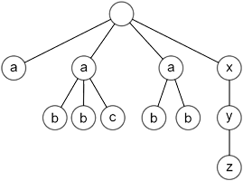

Let's have structured data stored in the data.in file, with the following format. The file contains sequence of tokens. Tokens are separated by whitespace characters (space, tabulator or new line). Token is either parenthesis '(', ')', or identifier, which doesn't contain any of '/', '*', '[', ']', '(' and ')' characters, and also must start with a character different than a number. Each identifier represents a node of a tree. If there is a opening parenthesis '(' after the identifier, all token up to the ending parenthesis ')' are interpretted as a list of children of that node. Identifiers doesn't need to be unique and parentheses may be nested in any way. Identifiers at the top level (not being contained within parentheses) are considered to be children of the root node, which has no identifier.

Data:

```a a ( b b c ) a ( b b ) x ( y ( z ) )```

Represents the following tree:



We want to perform a query into this tree, which is stored on the first line in query.in file. The result of the query will be a set of nodes. The query consist of a sequence of steps separated by '/' and the query also begins with a character '/'. Whitespaces (spaces and tabulators) are allowed within the query. Each step of the query corresponds to a mapping from a set of nodes to a set of nodes. First steps takes a one node set containing only the root and generates the corresponding set of nodes. Each following step will take the result of previous step and will generate a new set of nodes. Last step will generate the result of the query. We support the following kinds of steps:

identifier (e.g. "abc")  selects all the children with this identifier

\* (wildcard)  selects all the children no matter the identifier

..  selects the parents of processed nodes

Each step can also contain an arbitrary amount of predicates. Each predicate is contained within brackets '[', ']' and the content of the predicate is either subquery or one whole number. The predicate is used to filter the content of the set in the following way. If the predicate is a number, it will select only a node with such index (from 0) and will not select any other nodes. When choosing the correct node, we assume that the nodes are in the same order as how they appeared in the input file. If a node with such index doesn't exist, the predicate will select an empty set. If the predicate is a subquery (without leading '/'), this subquery is executed each time for each node of current set (in the same way as the whole query is executed for the root). If the subquery would select a nonempty set, then the original node is included in the resulting set, otherwise it is removed from the result. Predicates might be nested recursively.

Examples of queries on aforesaid tree:

/ selects the root /a| selects all a nodes (because they are children of the root)

/a/b selects all b nodes in the second level

/a/z emtpy set (there are no nodes z, which would be children of some a)

/a[b] selects those a nodes, which have at least one b children (thus second and third node a)

/a[b][c] selects all a nodes, which have at least one b children and at least one c children (thus second a node)

/*[y/z] selects all children of the root, which have a children y, that have children z (thus the x node)

/a[1]/b[1] selects second children of b rooted under second node a

/*/*/z/../.. selects grand ancestors of all z nodes from third level (again only the x node)

The result is supposed to be stored into the results.out file, each node being placed on individual line, in the same order as they were stored in the input file. The format of the output is a path from the root to the selected node, similar to the query -- as a sequence of steps separated by '/', also beggining with leading '/'. Each step contains the identifier of the selected node following by it's index between children in parentheses '(', ')'. There must be no additional whitespace characters.

Example of outputs:

```/ the root
/a(2) last (third) node a
/a(1)/c(2) node c rooted under second node a
/x(3)/y(0)/z(0) node z (last in the tree)```